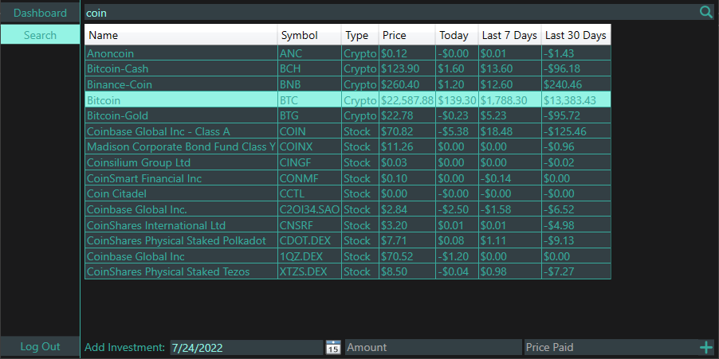

# InvestmentPortfolio
WPF application used to keep track of your current investment portfolio as well as see price history of investments you are interested in.

## Usage
DO NOT TRY TO BUILD THE PROJECT YOURSELF, IT IS MISSING THE REQUIRED CONFIG FILE.\
INSTEAD DOWNLOAD AND RUN THE [NEWEST RELEASE](https://github.com/derekackworth/InvestmentPortfolio/releases/latest).
```
Start InvestmentPortfolio: InvestmentPortfolio.exe

If the application freezes the API has been rate limited and you must wait before finishing the requests.
The API can only handle 5 requests per minute.
```

